<summary># Gladmc BOT</summary>
<p>Um BOT simples e leve para farmar AFK sem precisar abrir várias abas de Minecraft em seu computador.</p>


## Como Usar:

<details>
<summary>## Passo 1: Criar um BOT do Discord</summary>

<p>Primeiramente, é necessário criar um BOT do Discord em <a href="https://discord.com/developers/applications">Discord Dev</a>.</p>

<details>
<summary>### Passo 1.2: Criar o BOT</summary>

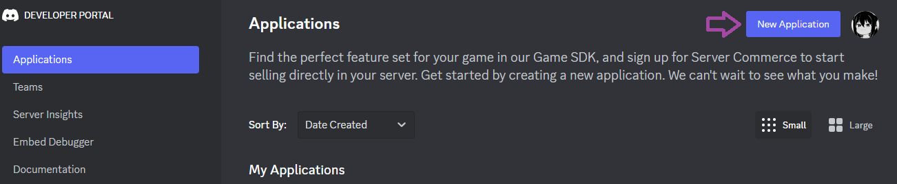

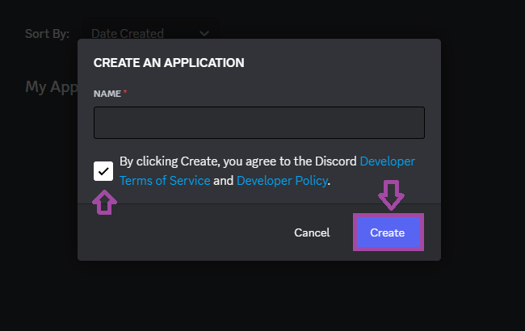
</details>

<details>
<summary>### Passo 1.3: Ativar os intents do BOT</summary>

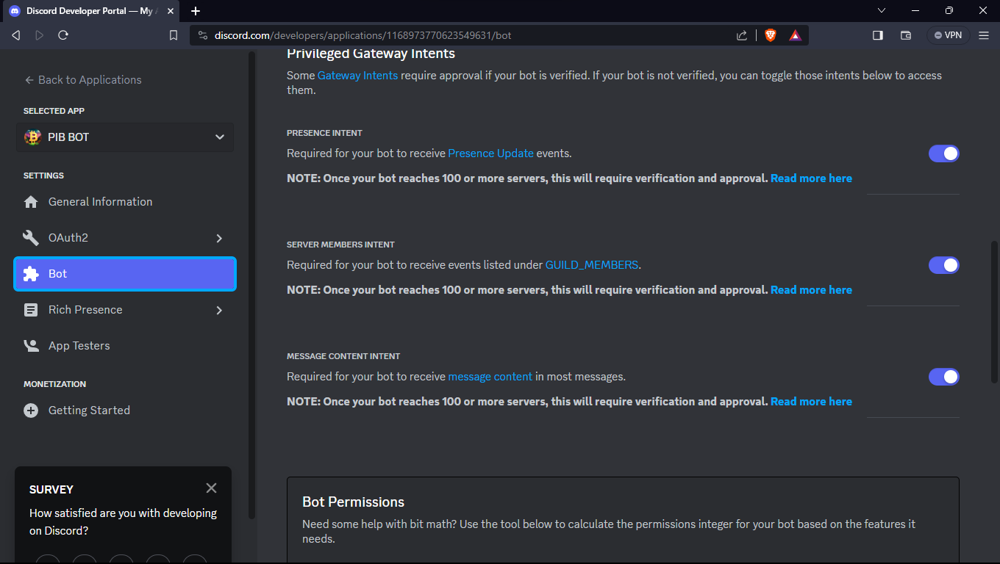
</details>

<details>
<summary>### Passo 1.4: Gerar um token para o BOT</summary>

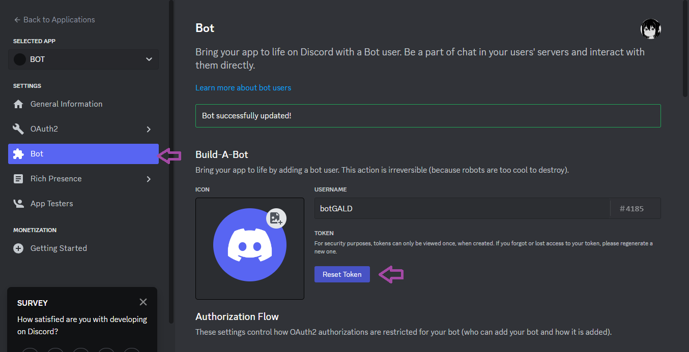
</details>

<details>
<summary>### Passo 1.5: Copiar o Token do BOT</summary>

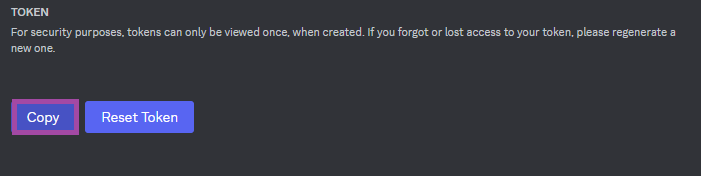

Copie o link e cole no navegador

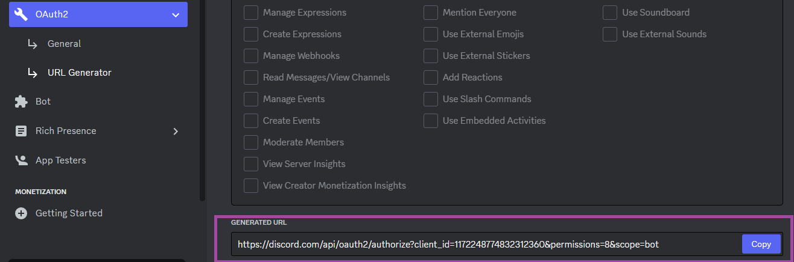

Escolha um grupo e adicione o BOT

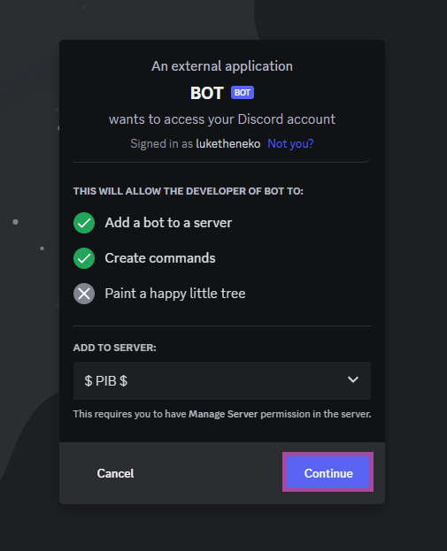

- Ative o modo desenvolvedor no seu Discord e copie o ID de um canal de texto onde serão executados os comandos do BOT.

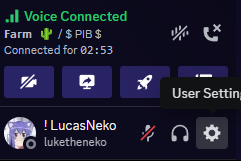
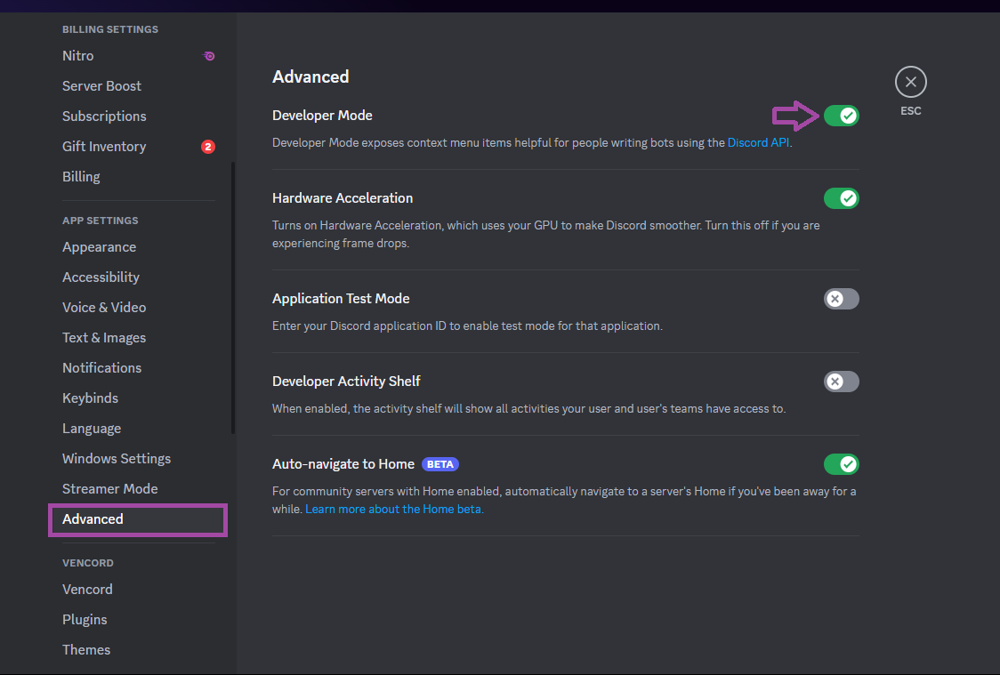
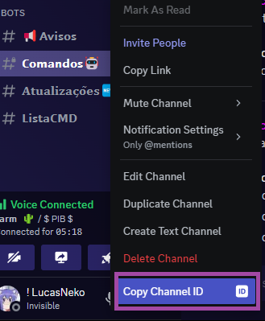
</details>

</details>

<details>
<summary>## Passo 2.1: Instalar Node.js</summary>

<p>Para a próxima etapa, é necessário instalar o <a href="https://nodejs.org/en">Node.js</a> na versão LTS.</p>
</details>

<details>
<summary>## Passo 3: Configuração</summary>

<p>Para começar, edite o arquivo `.env.example` para `.env`. Em seguida, abra o arquivo e configure com os dados do seu BOT.</p>

```json

TOKEN=COLE O TOKEN AQUI
CHANNEL=ID_DO_CANAL

```

</details>

<details>
<summary>## Passo 4: Instalar módulos do Node.js</summary>

<p>Para instalar os módulos do Node.js, clique no arquivo `Instalar.bat` dentro da pasta.</p>
</details>

<details>
<summary>## Passo 5: Configurar suas contas</summary>

<p>Edite o arquivo `accounts.txt.example` para `accounts.txt`.</p>

<p>Abra o arquivo `accounts.txt` e configure suas contas.</p>

Conta original:

```
seunick:123:/pw suapw:microsoft
```

Conta pirata:

```
seunick:suasenha:/pw suapw:
```

**AVISO:** Para o uso de contas originais, será necessário fazer login através do Microsoft/link, que será enviado no console do BOT junto com um código. Assim que logar usando o código enviado, aparecerá uma mensagem dizendo "LOGADO POR NINTENDO SWITCH". Se isso aparecer, deu tudo certo.

</details>

<details>
<summary>## Passo 6: Iniciar o bot</summary>

<p>Para iniciar o bot, basta abrir o arquivo `Start.bat`. Não é necessário fazer mais nada após isso. As contas começarão a entrar no servidor.</p>
</details>

<details>
<summary>## Comandos</summary>

```markdown
!comando NICKDOBOT - Executa o comando em uma conta
!comando all - Executa o comando em todas as contas **NÃO RECOMENDO USAR PARA COMANDO DE !CHAT** 
```

- `!start` -- Inicia os BOTS
- `!cana` -- Compra boost de 12% de cana
- `!cactus` -- Compra boost de 12% de cactus
- `!drop` -- Dropa os itens do inventário do BOT
- `!epic` -- Abre caixas épicas do /caixas
- `!len` -- Abre caixas lendárias do /caixas
- `!vermoney` -- Verifica o dinheiro dos outros
- `!topmoney` -- Verifica o dinheiro dos melhores
- `!balance` -- Verifica o dinheiro dos BOTS
- `!restart` -- Reinicia os BOTS
- `!stop` -- Para os BOTS
- `!chat` -- Envia mensagem através dos BOTS

### Exemplo de uso:

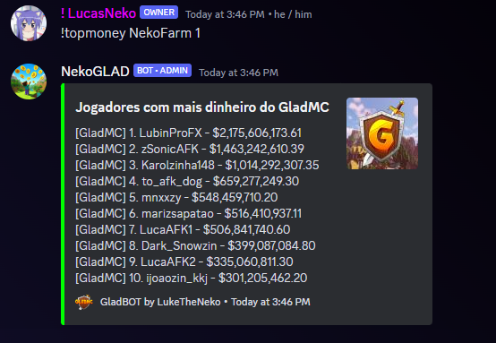
</details>